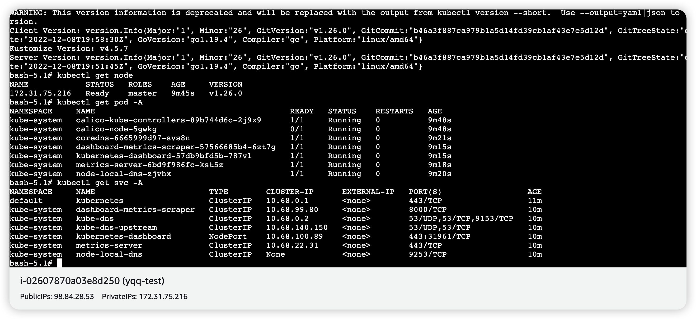
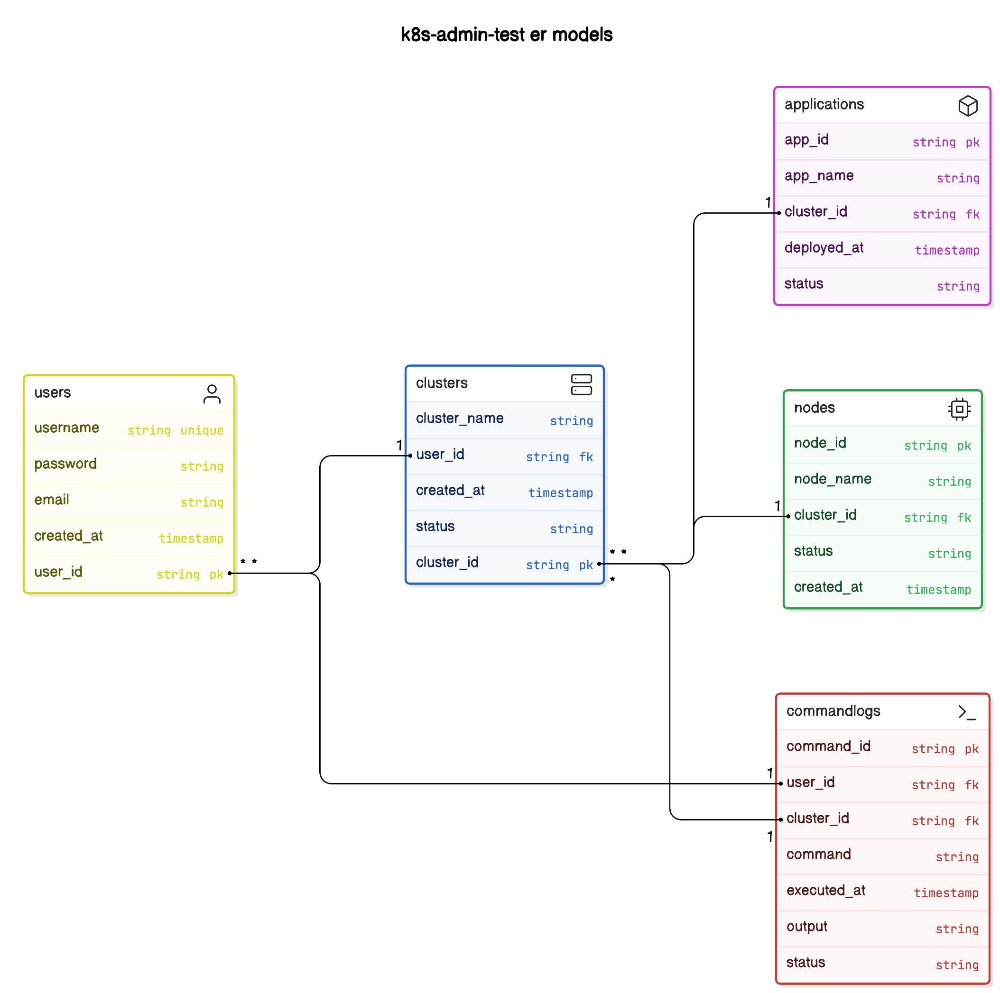

# k8s-admin-test

## task-view:
### Functional Requirements

1. **User Management**
   - **Registration**
     - Users can create an account.
   - **Login**
     - Users can log in to their accounts.
   - **Authentication**
     - Implement secure authentication (e.g., JWT, OAuth).

2. **Cluster Management**
   - **Create Clusters**
     - Users can create new Kubernetes clusters.
   - **Manage Nodes**
     - Users can add or remove nodes from their clusters.
     - Users can view the status of nodes.

3. **Application Deployment**
   - **Deploy Applications**
     - Users can deploy applications to specific nodes within their clusters.
   - **Application Management**
     - Users can view, update, or delete deployed applications.

4. **Command Line Interface**
   - **kubectl Integration**
     - Provide a frontend interface to issue `kubectl` commands.
     - Display output and logs from `kubectl` commands.

5. **Monitoring and Logging**
   - **Cluster Status**
     - Users can view the health and status of their clusters.
   - **Logs**
     - Provide access to logs from applications and Kubernetes events.

### Technical Considerations

- **Cloud Provider**: AWS (without using EKS or ECS).

### **Technical Design**

  - Develop the ER model diagram for user accounts, clusters, nodes, and applications.
  - Create an architectural diagram that outlines the overall system architecture.
  - Define the application framework (e.g., language, libraries, database).
  

 ## k8s Deploy Deployment
aws ec2 k8s
单节点，单机版本

## ER models
    1. **用户 (User)**
   - **属性**：
     - 用户ID (user_id, 主键)
     - 用户名 (username, 唯一)
     - 密码 (password)
     - 邮箱 (email)
     - 创建时间 (created_at)

2. **集群 (Cluster)**
   - **属性**：
     - 集群ID (cluster_id, 主键)
     - 集群名称 (cluster_name)
     - 用户ID (user_id, 外键，关联到用户)
     - 创建时间 (created_at)
     - 状态 (status)

3. **节点 (Node)**
   - **属性**：
     - 节点ID (node_id, 主键)
     - 节点名称 (node_name)
     - 集群ID (cluster_id, 外键，关联到集群)
     - 状态 (status)
     - 创建时间 (created_at)

4. **应用 (Application)**
   - **属性**：
     - 应用ID (app_id, 主键)
     - 应用名称 (app_name)
     - 集群ID (cluster_id, 外键，关联到集群)
     - 部署时间 (deployed_at)
     - 状态 (status)

5. **命令记录 (CommandLog)**
   - **属性**：
     - 命令ID (command_id, 主键)
     - 用户ID (user_id, 外键，关联到用户)
     - 集群ID (cluster_id, 外键，关联到集群)
     - 命令内容 (command)
     - 执行时间 (executed_at)
     - 输出 (output)
     - 状态 (status)

## er models图
er图

## 基本实现逻辑

### 1. 手动搭建 Kubernetes 集群

您可以在 AWS 上手动搭建 Kubernetes 集群，使用以下工具和步骤：

- **Kubernetes 部署工具**：使用 `kubeadm` 可以快速在 EC2 实例上搭建 Kubernetes 集群。
- **云实例**：创建多个 EC2 实例，作为 Kubernetes 的主节点和工作节点。

### 2. 部署应用程序

- **Docker 镜像**：
  - 在本地或 CI/CD 环境中构建 Docker 镜像，并推送到 Docker Hub 或 AWS ECR。
  
- **Kubernetes YAML 文件**：
  - 使用 Kubernetes 的 YAML 文件定义应用的部署、服务等资源。

- **kubectl 部署**：
  - 使用 `kubectl apply -f <your-deployment-file>.yaml` 命令在集群中部署应用。

### 3. 执行 kubectl 命令

- **kubectl 配置**：
  - 在用户登录后，生成并存储 Kubernetes 配置文件（通常是 `~/.kube/config`），以便 `kubectl` 可以访问 Kubernetes API。

- **后端处理**：
  - 在后端，使用类似 `os/exec` 的库（例如 Python 的 `subprocess` 或 Node.js 的 `child_process`）执行收到的 `kubectl` 命令。
  - 捕获命令输出，并将结果返回给前端。
  
## 备选方案
  直接用https://github.com/kubernetes/dashboard 作为前端操作入口
